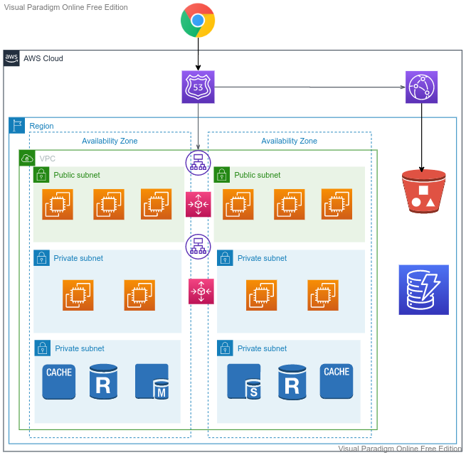

## Caching
- Caching is a process that stores multiple copies of data or files in a temporary storage location—or cache—so they can be accessed faster. 
- It temporarily saves data for software applications, servers, and web browsers, which ensures users need not download information every time they access a website or application.
- Cloudformation
- Web Tier
- Resource Tier

---

## Web Application

---
## Help
- https://github.com/aws-samples/amazon-elasticache-samples