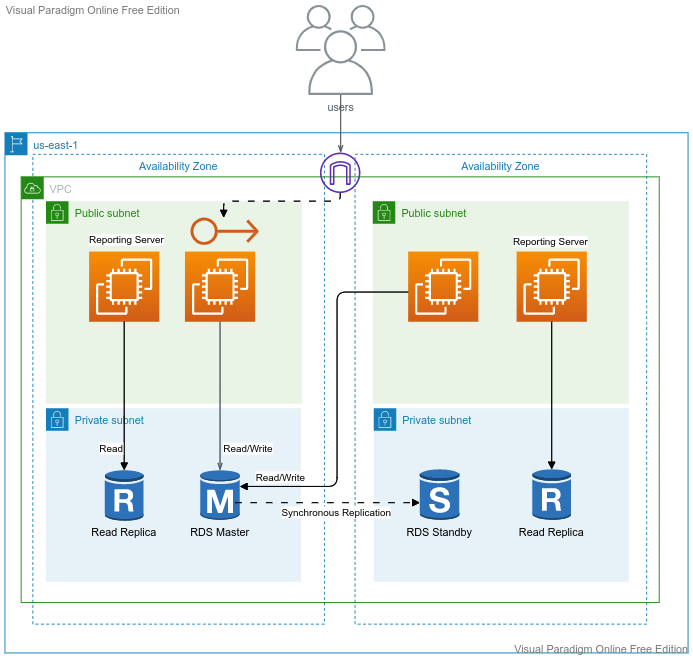

## RDS and DynamoDB

---
## Topics
- **Usecases for Database**
- **Create a RDS(MySQL) Instance**
- **Connect to RDS using MySQL Client**
- **Create a Database**
- **Connect to RDS from WebServer**
- **Create a DynamoDB Table**
- **Create a DynamoDB Global Table**
- **Create Items**
	
---

## What is RDS
## RDS Usecases
## What is DynamoDB
## DynamoDB Usecases

---

## RDS

---
## DynamoDB

---

      sudo yum -y install mysql
      mysql -h db-instance.cwy498e6o62a.us-east-1.rds.amazonaws.com -u admin -p
      CREATE DATABASE employee;
