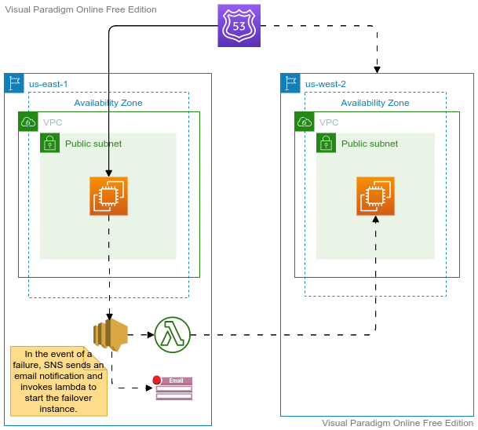

## AWS-DR (Level 200)

---

### 1. DR - Introduction

---

### 1. DR - Introduction

- **Disaster Recovery vs Backup**
- 
- **On-premise - On-Premise**
- From Physical data center
  - Another physical data center
  - Cloud
- From Cloud to to Cloud:
  - Same Vendor
  - Different Vendor
- **STS**

---
### Pilot Light

---

### Warm Standby

---
