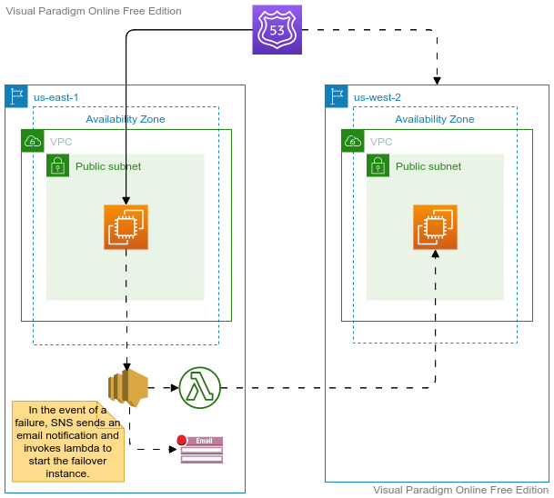
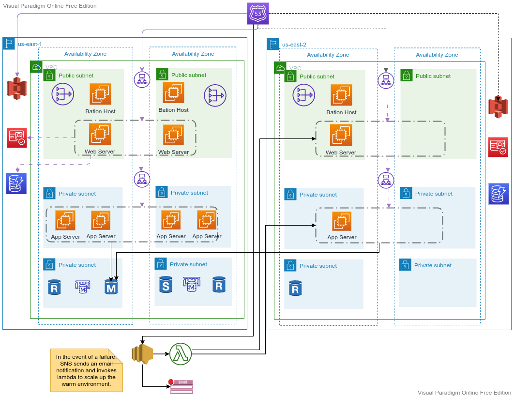

## AWS-DR (Level 200)

---

### 1. DR - Introduction
- Murphy's law: Everything that can go wrong will!
- In the world of IT, disasters are unavoidable, but when disaster happens, the organization should have a plan in place for getting the business critical data and workloads online.
- Disaster recovery (DR) is a critical component of the business continuity plan of all the organization. The failure to plan and manage the disaster recovery can lead to data/productivity loss and can also land the organization in audit and compliance issues
---

### 2. DR - Keywords

- **Disaster Recovery vs Backup**
  - Backup refers to the process of creating a copy of the data that can be restored in the event of an emergency. 
  - Disaster recovery, on the other hand, is all about keeping critical business workloads running following the disaster. 
---
- **RPO vs RTO**
  - RPO stands for Recovery Point Objective
    - The point in time in the past to which you will recover.
    - 
  - RTO stands for Recovery Time Objective
    - The time that it takes for the system to go from loss to recovery
    - The amount of time a business entity is willing to endure their IT services being unavailable
  
---
- **3-2-1 Rule**
  - The 3-2-1 backup rule is an industry-standard approach to ensuring your data is protected during a disaster. It helps to emphasize having at least three copies of your data, stored on two different types of storage media, and having at least one copy stored offsite.
---
### 3. DR Solutions
- **On-premise - Service Deployed on-premise**
  - From Physical data center
    - Another physical data center
    - Cloud
- **On-premise - Service Deployed on-premise**
  - From Cloud to to Cloud:
    - Same Vendor
    - Different Vendor

---
### 4. DR - Recovery Types
1. **Cold Failover (Backup and Restore):** This simple and low cost DR approach backs up your data and applications from anywhere to the AWS cloud for use during recovery from a disaster. 
2. **Pilot-Light:** In this DR approach, a part of the IT structure is replicated for a limited set of core services so that the AWS cloud environment seamlessly takes over in the event of a disaster.
3. **Warm Standby:** A DR solution in which a scaled-down version of a fully functional environment is always running in the cloud. 
4. **Hot or Multi-Site:**  A multi-site solution runs on AWS as well as on your existing on-site infrastructure in an active- active or active-passive configuration. 
---
### 4. DR - Demo

- [Lambda Code](./assets/lambda_code.md)
  
---

### Pilot Light

---

### Warm Standby

---

### Help

- https://aws.amazon.com/blogs/publicsector/rapidly-recover-mission-critical-systems-in-a-disaster/
- https://www.youtube.com/watch?v=lK_t_dhUh5I
- https://d1.awsstatic.com/events/reinvent/2019/REPEAT_1_Hands-on_Building_a_multi-region_active-active_solution_ARC309-R1.pdf
- https://github.com/aws-samples/disaster-recovery-playbook-for-aws-cn

