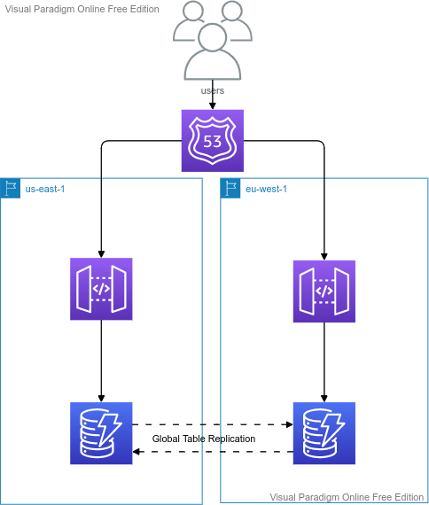

## DynamoDB

---
## Topics
- **Create a DynamoDB Table**
- **Create a DynamoDB Global Table**
- **Create Items**
	
---

## DynamoDB 
- NoSQL Database
- Fully Managed, Highly Scalable
- Horizontally Scalable
- Signle digit milisecond latency
- Millions of Requests per second
- Millions of Rows
- 100s of TBs storage
- Fast and Consistent
- Event Driven capabilities using DynamoDB streams
- Integrated with IAM

---

## Terminology
- Table
- Row/Items
- Attributes
- Item Size - Max 400kb
- Datatype -
  - Scalar Type: String, Number, Boolean, Binary, Null
  - Document Type: List, Map
  - Set Types

---

## DynamoDB - Primary Key
- Partition Key Only (Hash)
  - must be unique
  - must be diverse 
  - Example - user id
- Partition Key + Sort Key
  - Combination must be unique
  - Example partition key = user id, sort key = game id
- data is always grouped by partition key irrespective of the primary key type
- A row contains Primary key and attributes

---

## Example
- Movies - 

---

## Provisioned Throughput
- RCU (Read Capacity Unit)
  - Strongly Consistent Read
  - Eventually Consistent Read
  - Default option is Eventually Consistent Read, but Scan, Query, GetItem have a parameter ConsistentRead
  - 1 RCU represents **one Strongly Consistent Read** or **two Eventually Cosistent Read** per second for one item upto 4kb in size
  
---

- WCU (Write Capacity Unit)
  - 1 WCU represents one write per second for one item upto 1kb in size
- ProvisionedThroughputExceptions
- Exponentialback-off retry
- WCUs and RCUs are evenly distributed among partitions
- Hot Parition
  
---

## Indexing
- LSI (Local Secondary Index)
  - Must be created at Table creation time
  - 5 LSIs per table
- GSI (Global Secondary Index)
  - Helps to speed up queries on non-key attribute
  - 20 GSIs per table

---
## Misc:
- Concurrency - Optimistic Locking
- DAX - DynamoDB Accelarator - Caching for DynamoDB
  - 5 minutes TTL by default
  - solves hotkey problem
- DAX vs ElastiCache
- DynamoDB streams
  - Changes to DynamoDB table end up in streams
  - 24 Hours retension
  - Cross Region Replication

---

## Security
- VPC Endpoint
- IAM Access Control
- Data at rest
- Data in transit

---

## DynamoDB

---

## Help

- https://aws.amazon.com/blogs/database/choosing-the-right-dynamodb-partition-key/
- https://docs.aws.amazon.com/amazondynamodb/latest/developerguide/LSI.html
- https://docs.aws.amazon.com/amazondynamodb/latest/developerguide/SampleData.CreateTables.html