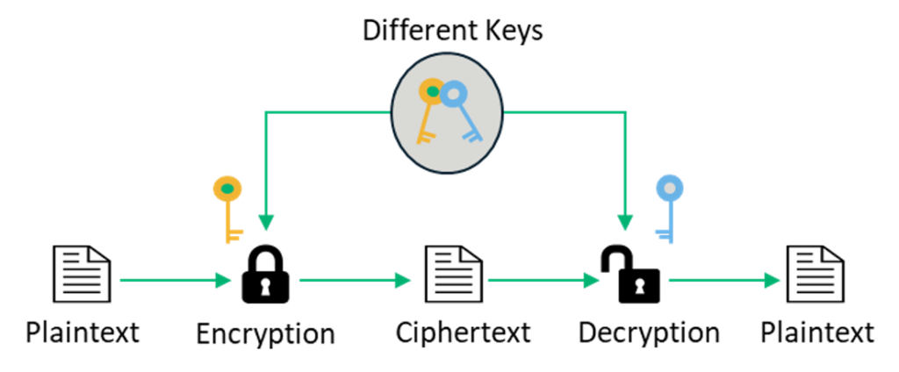
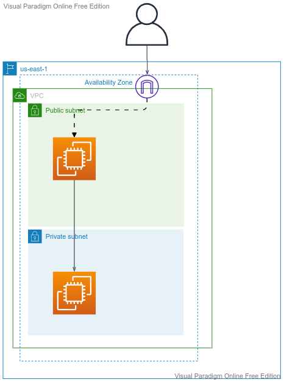

## AWS-EC2

---
## Topics
- **Compute in AWS**
- **EC2 Tenancy and Types**
- **SSH and concept of Keys**- 
- **Public IP, Private IP, Elastic IP**
- **Create Linux instances (public and private) and securely ssh into to it**
- **Security Groups**
- **Instance MetaData**
- **Instance UserData**
- **Assign IAM Roles to EC2 Instance**
- **Create an AMI**
	
---

# Compute in AWS:
- EC2
- ECS - Containers
- Lambda

---

## What is EC2
- Infrastructure as Service
- Virtual Servers in AWS
- Input:
  - OS
  - CPU
  - RAM
  - Storage
  - Network details
  - Firewall Rules
  - bootstrap script (optional)

---

## EC2 Tenancy
- Shared:
  - On-Demand
  - Spot
  - Reserved
- Dedicated Instance
- Dedicated Host
  
## Instance Types:
  - T2/T3 - General Purpose
  - C - Compute Optimized
  - R - Memory Optimized
  
---

## Public IP, Private IP, Elastic IP
A **Public IP** address is how the internet identifies you. A public IP address is the IP address that communicates your internet connected device to the public internet. Public IP will be modified with ec2 stop/start.

A **Private IP** address is how the VPC identifies you. A private IP address is the IP address that communicates with other devices in your VPC. Private IP will not be modified with ec2 stop/start and reboot.

A **Elastic IP** address is a Public IP address which is static. 

---

## Connect to EC2
- SSH, also known as Secure Shell or Secure Socket Shell, is a network protocol that gives users, particularly system administrators, a secure way to access a computer over an unsecured network.
- Secure Shell provides strong password authentication and public key authentication, as well as encrypted data communications between two computers connecting over an open network, such as the internet.

---

---

## SSH into the EC2 instance - 1
- ssh into public instance using private key
  

---
## SSH into the EC2 instance - 2
- ssh into private instance with ssh agent forwarding
  

---
## SSH into the EC2 instance - 3

      eval `ssh-agent -s`
      ssh-add -k <PEM FILE>
      ssh-add -l
      ssh -A <user>@<IP ADDRESS>

---

## Demo 
- Web Server with RDS
- Web Server crash and Create an AMI
- Create new Web Server from the AMI
- Attach Elastic IP to avoid redistributing the IP
- Instance MetaData
- Instance UserData

---
## Instance MetaData and UserData

      #!/bin/bash
      yum update -y
      yum install -y httpd
      systemctl start httpd
      systemctl enable httpd
      echo "Hello World $(hostname -f)" > /var/www/html/index.html

      curl http://169.254.169.254/latest/meta-data/local-ipv4
      
      curl http://169.254.169.254/latest/meta-data/iam/security-credentials/EC2_S3FullAccessRole

      curl http://169.254.169.254/latest/user-data
--- 

      sudo mkfs -t ext4 /dev/xvdb
      sudo mount /dev/xvdb /mnt
      sudo umount /mnt
---
## Web Server with RDS

---
## Web Server with RDS - Automation

---

### Help

- https://aws.amazon.com/blogs/security/securely-connect-to-linux-instances-running-in-a-private-amazon-vpc
- https://docs.aws.amazon.com/AWSEC2/latest/UserGuide/instancedata-data-retrieval.html
- http://web.mit.edu/smadnick/www/wp/2020-16.pdf
- https://medium.com/@shurmajee/aws-enhances-metadata-service-security-with-imdsv2-b5d4b238454b
- https://medium.com/swlh/capital-one-data-breach-a-cloud-security-case-study-7a06ec900460
- https://docs.aws.amazon.com/AmazonRDS/latest/UserGuide/CHAP_Tutorials.WebServerDB.CreateWebServer.html
- https://sectigostore.com/blog/5-differences-between-symmetric-vs-asymmetric-encryption/
- https://www.hostinger.com/tutorials/ssh-tutorial-how-does-ssh-work
- https://dyclassroom.com/reference-server/how-to-setup-ssh-key-based-authentication-on-linux-server
- https://blog.runcloud.io/why-authentication-using-ssh-public-key-is-better-than-using-password-and-how-do-they-work/
https://stackoverflow.com/questions/59555705/how-ssh-encrypts-communications-when-using-password-based-authentication
- SSH using PuTTy: https://help.dreamhost.com/hc/en-us/articles/115001764232-Connect-to-your-DreamCompute-Instance-with-SSH-keys-in-Windows
