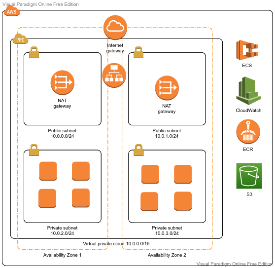

# Agenda
- Prerequisite
- Brainstorming
- Elastic Container Service(ECS)
- Hands-on Lab
- Cleanup
- Summary
- Quiz
---

# Prerequisite:
  - VPC, CIDR, Private/Public Subnet, Security Group
  - Basics of Docker 

---
# What to expect
After today's session, you should be able to:
- Create a ECS Cluster in AWS (EC2, Fargate)
- Create a ECS Cluster in AWS (EC2, Fargate)
---
# Brainstorming
  - What are the different computing options available in AWS. How they are different from each other and usecases around them.
    - EC2(IaaS), ECS(CaaS), Lambda(FaaS)
    - Use case - When to use what
  - What are the difference between Private and Public Subnet
  - Internet Gateway, Route Table, NACL, Security Group
  - What is a Bastion Host and why we need them
  - What is NAT Gateway.
  - Comparision - NAT Gateway vs NAT Instance
  - What is load balancing
  - Load Balancers in AWS (ALB, NLB, CLB)
  - Target Group, Auto Scaling Group
  
---
# Reference

---

---

---

---

# Microservices:

---

# Elastic Container Service (ECS)

Amazon Elastic Container Service (Amazon ECS) is a fully managed container orchestration service.

  - ECS Cluster - Logical group of EC2 instances
  - Container Instance (or EC2 Instances in a Cluser with an ECS agent running in it)
  - Task Definition: Metadata to tell ECS how to run a docker container
  - Task: The docker container that is running
  - Service: Helps define how many tasks to run and how
  - ECS agents register the EC2 with ECS service
  - Launch Type - EC2 and Fargate
  - ECS Task Placement Strategy
  - ECS Task Placement Constraints
  - ECS Networking Mode (Node, Bridge, Host, awsvpc)

---

# Hands-on Lab

  - Create an ECS Cluster
  - Create Task Definition
  - Create an ALB to later associate with ECS Service  
  - Create the Service that runs the Task Definition
  - Check everything is working
  - Scale In/Out

---

# Summary

--- 

# Cleanup

Do not forget to cleanup the created resources. 

---
# Quiz
- **An e-commerce application is migrating towards a microservices-based approach and plans to expose their website from the same load balancer, linked to different target groups with different URLs: api.example.com, www.example.com, etc. The website would like to use ECS on the backend to manage these microservices and possibly host the same container of the application multiple times on the same EC2 instance. Which feature can help you achieve this with minimal effort?**

  - Classic Load Balancer with dynamic port mapping
  - Network Load Balancer with dynamic port mapping 
  - Application Load Balancer with dynamic port mapping
---
- **A leading media services company has implemented a multi-tiered networking structure within the VPC. The public subnets are used to deploy the Application Load Balancers, while the private subnets are used to deploy the application on ECS Containers. As part of the requirements, the ECS Containers are required to have access to the internet. As a Solutions Architect, what will you recommend, the solution has to be fully managed by AWS and working over IPv4?**
  - NAT Gateways deployed in your public subnet
  - NAT Instances deployed in your public subnet 
  - Internet Gateways deployed in your private subnet
  - Egress-Only Internet Gateways deployed in your private subnet
---
- **A leading streaming services company is moving its dockerized application stack into AWS. The company is not sure about the pricing for using Elastic Container Service (ECS) with various launch types, the EC2 launch type vs the Fargate launch type. Which of the following is correct regarding the pricing?**

  - Both launch types are charged based on vCPU and memory resources that the containerized application requests
  - Both launch types are charged based on EC2 instances and EBS volumes used
  - Both launch types are charged per hour
  - ECS with EC2 launch type is charged based on EC2 instances and EBS volumes used. ECS with Fargate launch type is charged based on vCPU and memory resources that the containerized application requests

---

# Thank You
