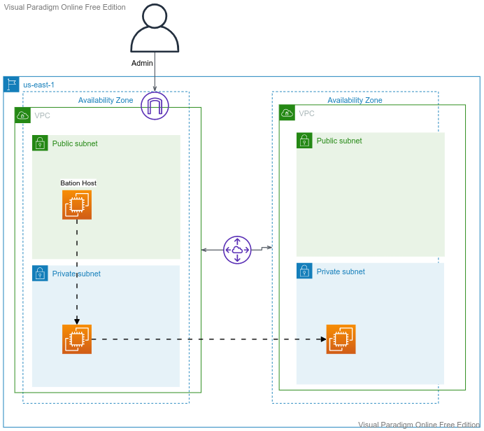
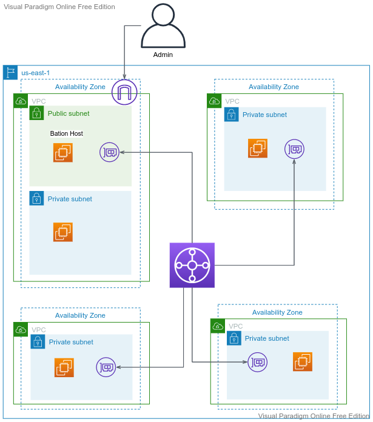

# Advanced Networking Lab

---

## Recap:
  - VPC
  - Subnets - Public, Private
  - Routing - Routing Table
  - Security - NACL, Security Group
  - Governance - Flow Logs
---
## Use Cases:
  - Internet Gateway
  - VPC Peering
  - Transit Gateways
  - Private Link
  - VPN 
  
---

## Lab - VPC Peering
  - Create VPC-1 - 10.1.0.0
    - Create Public Subnet - 10.1.1.0/24 
    - Create Private Subnet - 10.1.0.0/24
  - Create VPC-2 - 10.2.0.0
    - Create Private Subnet - 10.2.0.0/24
  - Create VPC-3 - 10.3.0.0
    - Create Private Subnet - 10.3.0.0/24
---

---

## Lab - Transit Gateway
---

---

## AWS Private Link - S3

      aws s3 --region us-east-1 --endpoint-url https://bucket.vpce-1a2b3c4d-5e6f.s3.us-east-1.vpce.amazonaws.com ls s3://my-bucket/

---

## Help
  - https://www.davidc.net/sites/default/subnets/subnets.html
  - https://docs.aws.amazon.com/AmazonS3/latest/userguide/privatelink-interface-endpoints.html
