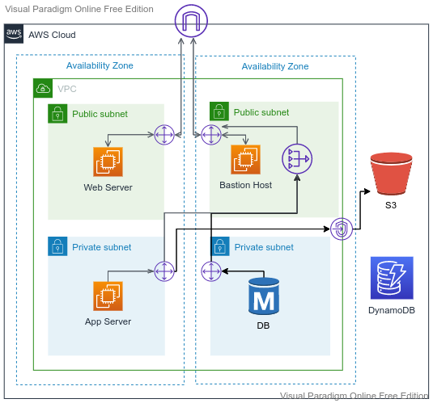

# Networking Lab

---

## VPC:
   - General Guideline:
     - Use Route Table, NAT Gateway, VPC Gateway for S3, NACL, Security Groups and Elastic IP
     - Think of different ways to solve the same networking outcome
     - When choosing the service, please think why this, why not that

---

   - Web Server:
     - Allow outside traffic(HTTP(80) and HTTPS(443) only) to reach to Web Servers
   - Bastion Host:
     - Allow ssh(port 22) traffic from your local machine to reach to the Bastion Host. 
     - No other traffic should be allowed to Bastion Host.
  
---

   - Application Server:
     - Can reach to Internet
     - Should accept SSH traffic(port 22) from Bastion Host
     - Should accept requests from Web Servers in port 8080 and 8000
     - No one from the outside of VPC is allowed to reach them

---
  
   - DB Subnet:
     - MySQL - No need to install mysql. A place EC2 instance without any database will be enough for this lab. 
     - Allows traffic from App Servers ONLY in port 3306
     - DB Servers should not be able to access internet. Lets assume we will manage the patching with some other means and this lab is to show the capability. 
     - No one from outside of VPC is allowed to access 
  
---

   - S3:
     - should be accessible from App Server privately using the VPC endpoints
     - Enable flow log to check out the access
--- 

## VPC With Public Subnet (Level - 300):
   

---

## Help
- https://www.davidc.net/sites/default/subnets/subnets.html
- https://cidr.xyz/

