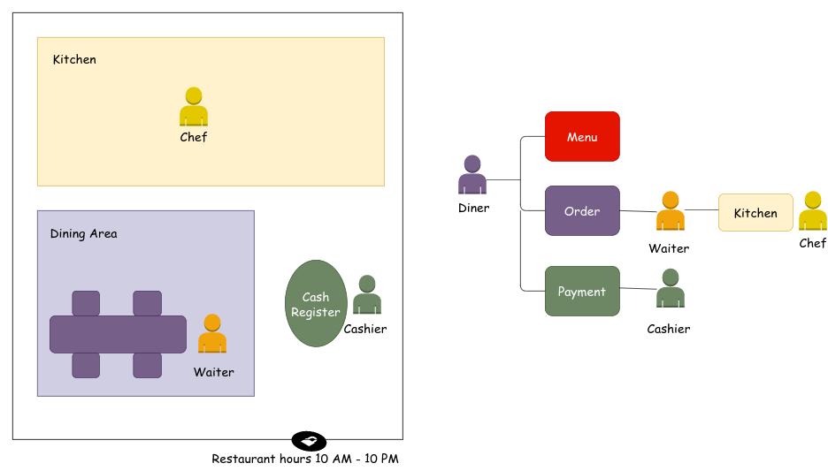
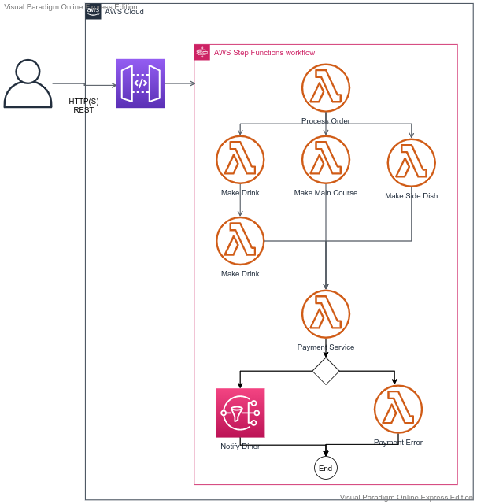

# Restaurant Web Application

# Questions for an AWS Solutions Architect 
- Assuming we will develop the Restaurant Use case in AWS, what are the AWS services to use?
- What are the Compute options available? Which one to pick?
  - EC2 vs Lambda, what are the differences
  - When I should use Lambda over EC2 and vice versa
- In the restaurant use case which one you would prefer? EC2 or Lambda? Why?
- Is there a place where we can use
  - SQS (Can we develop a solution without SQS? Is it required? WHat is/are the other services that can be used?)
  - SNS
  - API Gateway
  - API
- In the restaurant use case diagram, can you give an analogy between the blocks(Dining area, Kitchen, Cash Register, Diner, Chef, Cashier, Menu, etc) and AWS Services(API Gateway, API, SQS, SNS, Database)

# Step Function Example

## https://docs.aws.amazon.com/step-functions/latest/dg/tutorial-api-gateway.html

# Questions for an AWS Solutions Architect 
- What are step functions?
- Why we would need them?
- Why NOT to use Step Functions?
- How we create sequential and parallel steps?
- How to handle error?
