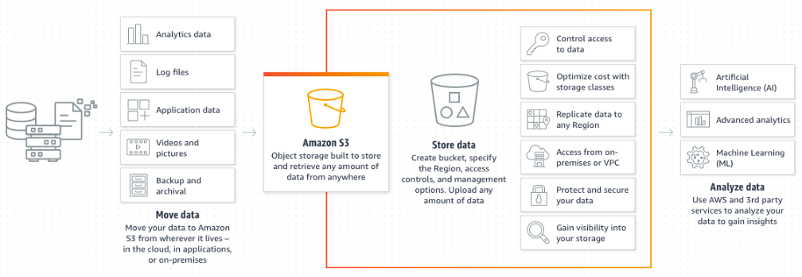

# S3 (Simple Storage Service)
Provides a simple(and secure) way to **Store, Distribute** and **Analyze** data in the Cloud. 

---

# Today's Topics

- What is S3
- Use Cases
- When to Use
- Features
- Demo
  
---

## What is S3
  - Object Storage
  - durable and available
  - help in decoupled architecture, can trigger events
  - access can be controlled (bucket policy, pre-signed url)

--- 

## Use cases
  - Store and distribute static web content and media 
  - Host entire static web site
  - Data store for computation and large-scale analytics
    - financial
    - media transcoding
    - clickstream analytics
  - Backup tools

---

## When to Use and When NOT to use
  - When to use:
    - Write once and read many times
    - spikey data access
    - large number of users and diverse content
    - growing data sets
  - When NOT to use:
    - Block storage requirements
    - Frequently changing data
    - Long-term archival storage
  
---

## Cost
Pay as you go
  - GBs per month
  - Transfer out - Internet and to another region
  - PUT, POST, COPY, LIST, GET requests
  - No cost for:
    - Transferring IN
    - Access from EC2 in the same Region
    - Cloudfront access

---

## Features
  - S3 Versioning
  - Moving data into s3
    - console
    - cli
    - sdk
    - multipart
    - transfer accelaration 
    - snowball 
    - snowmobile
  - Security around S3
  - Logging and Montoring
  - Analyze data

---
# S3 Storage Type (Storage Class)
Amazon S3 offers a range of storage classes designed for different use cases. 
  - S3 Standard for general-purpose storage of frequently accessed data
  - S3 Intelligent-Tiering for data with unknown or changing access patterns
  - S3 Standard-IA for long-lived, but less frequently accessed data
  - S3 One Zone-IA for long-lived, but less frequently accessed data
  
---

# S3 Glacier
- Long-term data storage
- archival or backup
- very low cost storage

- Use Cases:
  - Audit Log Archive with Vault-Lock
- Retrive Data from Glacier
  - Expediate
  - Standard
  - Bulk

---

# Glacier Storage Type (Storage Class)
Amazon S3 offers a range of storage classes designed for different use cases. 
  - S3 Glacier for long-term archive and digital preservation
  - S3 Glacier Deep Archive for long-term archive and digital preservation
 
---

# S3 Lifecycle Policy

Amazon S3 offers capabilities to manage your data throughout its lifecycle. Once an S3 Lifecycle policy is set, your data will automatically transfer to a different storage class without any changes to your application.
  
---

# Choosing a Region:
  - Data Residency and Regulatory Compliances:
    - Are there any relevant region data privacy laws?
    - Can Customer Data be stored outside of the country?
    - Can you meet the Governance Obligation?
  - Proximity of users to data
  - Service and Feature availability
  - Cost Effectivenes

## Help
- https://gist.github.com/magnetikonline/6215d9e80021c1f8de12#full-access-and-s3-console-for-specific-iam-users