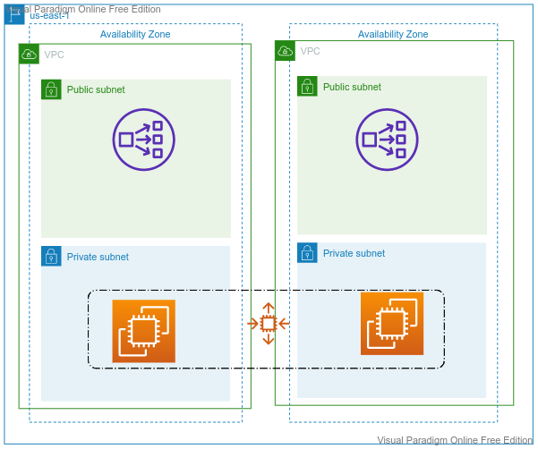

## Scalability
- Scalability is the system's ability to adjust with demand. Various use cases can be Stock Market, Bank, Hospital, E-commerce WebSite. 
- As per the AWS Well-Architected Framework, an ideal system should be well operable, secured, reliable, performant, and cost-effective. 
- Where does the scalability help?
- Scalability is not the same as High Availability
- Types:
  - Vertical Scalability (Non-distributed systems)
  - Horizontal Scalability (elasticity)
- Benefits of scalable systems
- How to achieve scalability

---
## High Availability
- High availability (HA) is the ability of a system to operate continuously without failing for a designated period of time. 
- HA works to ensure a system meets an agreed-upon operational performance level. 
- 
---

## Load Balancers
- Load Balancers are servers that distribute traffic to multiple backend servers
- Out of four types of Load Balancers in AWS, our focus can be on two:
  - Application Load Balancer
  - Network Load Balancer
- Layers in OSI Model: Layer 1: Physical Layer, Layer 2: Data Link Layer, Layer 3: Network Layer, Layer 4: Transport Layer, Layer 5: Session Layer, Layer 6: Presentation Layer, Layer 7: Application Layer
- ALB is a Layer - 7 load balancer
- NLB is a Layer - 4 load Balancer
- The “level” of a load balancer refers to how far back up the network stack a network communication must travel before the load balancer can direct it on its way back down the stack towards its final destination.

---
## Elasticity

- Target Group
- Launch Template
- Auto Scale Group
- Capacity
  - Minimum
  - Maximum
  - Desired
- Health Check
- Scaling Policy
  - Simple
  - Step
  - Scheduled
- Cross-zone load balancing

---

## NLB
