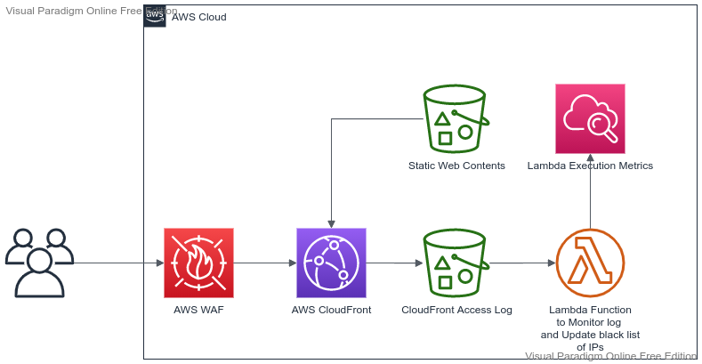

## AWS WAF:
  - **Prerequisites (Level 100)**
    - OSI Model Layer 5-7 attack (Application Level attack)
    - Content Delivery - CloudFront
    - Logging - CloudWatch
    - Storage - S3
    - Automation - Lambda
    - Programming Language - Python or JavaScript

---

## WAF Automation (Level - 100):
   

---
## Use Case

- User access the Web Application through CloudFront. 
- CloudFront reclogs are captured in S3,
- Lambda Function gets triggerred for every new upload of log. It identifies the IP addresses, that have made more requests than the threshold defined and adds them to WAF block list.
- WAF blocks these IP addresses for a period of time. After this blocking period gets expired, AWS WAF allows these IP addresses to access our application again
- The Lambda function also publishes execution metrics in CloudWatch.
