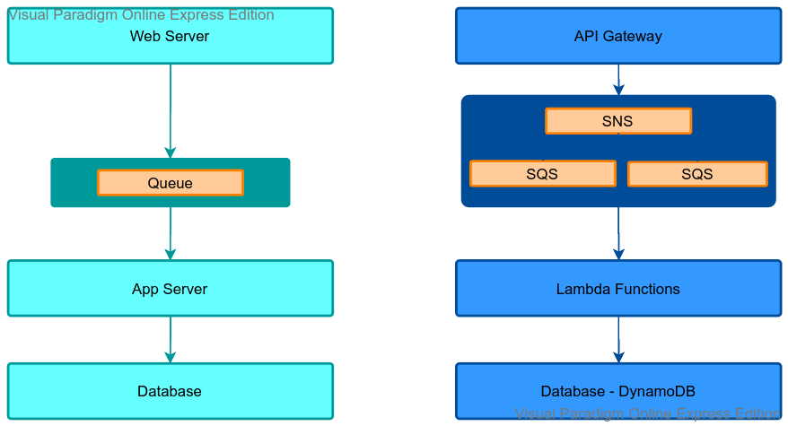
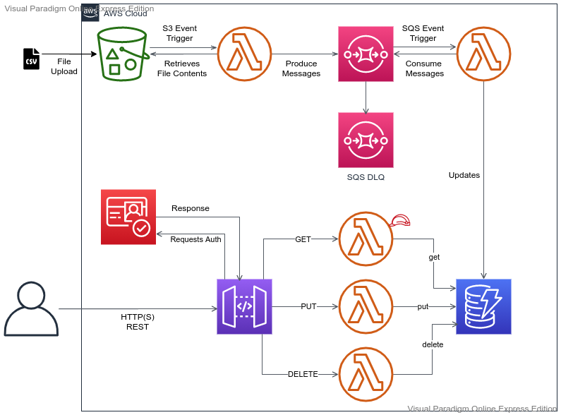

# Agenda
- Prerequisite
- Develop Web Application using AWS Serverless
- Hands-on Lab
- Cleanup
- Summary
- Quiz
---

# Prerequisite:
  - 3 tier Web Application Architecture
  - REST WebServices
  - Knowledge about Database - SQL, NoSQL
  
---
# Reference



---

# Serverless Architecture with AWS

Serverless applications don’t require provisioning, maintaining, and administering servers for backend components such as compute, databases, storage, stream processing, message queueing, and more.

---

# Example



---

# AWS Services
  
  - Compute: Lambda
  - Storage: S3
  - Database: DynamoDB
  - Application Integration: SQS
  - Security: IAM, Cognito
  - Networking and Content Delivery: API Gateway
  - Management and Governance: CloudWatch 

---

# DynamoDB
Fully managed, fast, highly available(replicated across 3 AZs) NoSql database with very low latency 
  - Data Types
  - Max size of an Item - 400kb
  - On-Demand vs Provisioned
  - Consistency Model - Strongly vs Eventual 
  - RCU vs WCU
  - Partition Key, Sort Key
  - Indexing - LSI, GSI
  - DAX, Streams
  
---

# API Gateway
Serverless endpoint for REST APIs, publicly accessible from clients
  - Supports integration with Lambda, HTTP Endpoints, AWS Services
  - API Endpoint Types, Edge Optimized, Regional, Private
  - Support versioning and Stages 
  - Support Security
  - API Keys
  - APISecurity - IAM, Cognito, Lambda Authorizer
  
---

# 4. Hands-on Lab - 1

---
# 4.1 Create DynamoDB Table
- user_id - Partition key
- timestamp - Sort key
- transaction_id
- cost
- item_id
- type

## Index:
- LSI
  - lsi_type
  - lsi_cost
---

# 4.2 Create Lambda Function to save data in DynamoDB

- ***index.js***
- ***Environment variables***
  ```markdown
  TABLE_NAME
  ```
---
- ***payload for post call***
  ```markdown
  {
    "body": {
      "Item": {
        "user_id": "USER4",
        "timestamp": "1610911286",
        "type": "PURCHASE",
        "item_id": "ITEM673",
        "cost": 673,
        "transaction_id": "0fe2c4e3-b127-4766-a775-63d15a9f6f19"
      }
    }
  }
  ```

---

# 4.3 Authentiction using Cognito

Create User Pool with App Client and Authorizer in API Gateway

  ```markdown
  aws cognito-idp sign-up --client-id <CLIENT_ID> --username <USER> --password <PASSWD>

  aws cognito-idp admin-confirm-sign-up --user-pool-id <POOL_ID> --username <USER>

  aws cognito-idp admin-initiate-auth --cli-input-json file://credential.json

  ```
  ```markdown
  credential.json example:

  {
    "UserPoolId": "<POOL_ID>",
    "ClientId": "<CLIENT_ID>",
    "AuthFlow": "ADMIN_USER_PASSWORD_AUTH",
    "AuthParameters": {
        "USERNAME": "<USER>",
        "PASSWORD": "<PASSWD>"
    }
  }
  ```


---

# 5. Hands-on Lab - 2

---
# 5.1 S3 Bucket
- ***Create Bucket***
- ***Create Event Notification to trigger Lambda***
# 5.2 Create SQS standard queue
- ***Create a Standard Queue***
---

# 5.3 Create Lambda Functions:
- ***To retrive data from S3 and send message to SQS***
  - Role: 	sDemo-role-S3toSQS
  - Policy: 	S3, SQS, CloudWatchLog
  - Python: 	demo-fn-s3-sqs.py.py
  - Environment variables
    ```markdown
    SQS_QUEUE_URL
    TABLE_NAME
    ```
- ***To retrieve messages from SQS and create items in DynamoDB table***
  - Role: sDemo-role-SQStoDynamo
  - Policy: 	SQS, DynamoDB, CloudWatchLog
  - Python: 	demo-fn-sqs-dynamodb.py

---

# 6. Hands-on Lab - 3

- ***Create Step Function***
  ```markdown
  ASL Code Example: asl.txt
  ```
- ***Give Permision to Execute Lambda***
- ***Create a Lambda Function to trigger the Step function***
- ***Test the step function***

---

# Summary

--- 

# Cleanup

--- 

# Quiz
- **You have created an S3 bucket in us-east-2 region with default configuration. You have deleted an object in the bucket using AWS CLI. However, when you tried to list the objects in the bucket, you still see the object you deleted.**
  - AWS keeps copy of deleted object for 10 days in STANDARD storage
  - AWS provides eventual consistency for DELETES.
  - AWS provides strong consistency for DELETES
  - AWS doesn't support DELETEs through CLI.

---
  
- **You have an S3 bucket in the us-east-2 region with few documents and need to be shared with a group within the organization granting them access for a limited time. What is the recommended approach**
  - Create one IAM user per person, attach managed policy for each user with GetObject action on your S3 bucket. Users can log in to AWS console to download the documents.
  - Create one IAM user per person, add them to an IAM group, attach managed policy for the group with GetObject action on your S3 bucket. Users can log in to AWS console and download the documents.
  - Generate a pre-signed URL with an expiry date and share the URL with all persons via email.
  - Enable the public access for the S3 bucket and share the bucket URL with all persons via email.

---

## Help
- https://aws.amazon.com/getting-started/projects/build-serverless-web-app-lambda-apigateway-s3-dynamodb-cognito/module-4/

# Thank You
